<div align="center">

# GlassPos

### Production workshop POS built around transaction integrity

**Laravel 12 · PHP 8.2+ · MySQL · Pest · PHPStan · Hexagonal Architecture**

GlassPos is a workshop point-of-sale and operations system designed for the part most POS demos politely avoid: what happens after money, stock, payments, revisions, refunds, procurement, and reports all begin affecting the same transaction.

[Product Tour](#product-tour) · [Transaction Integrity](#transaction-integrity) · [Architecture](#architecture) · [Engineering Evidence](#engineering-evidence) · [Setup](README_SETUP.md) · [Technical README](README_TECHNICAL.md)

</div>

<p align="center">
  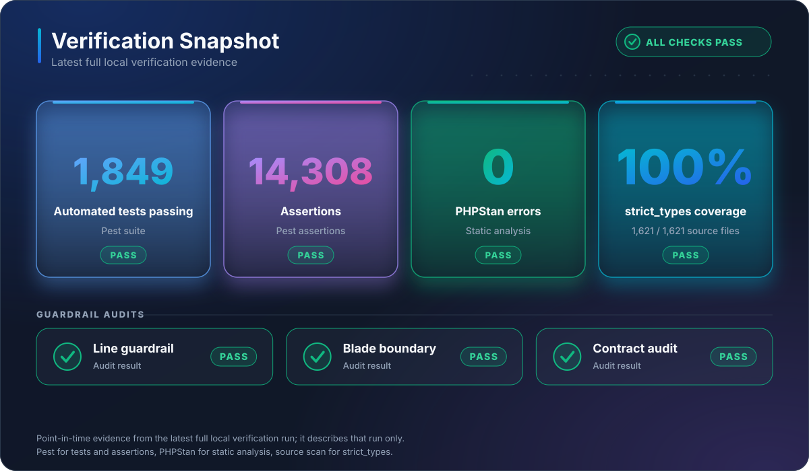
</p>

> **The core problem is not CRUD. It is state coherence.** A transaction can change cash, stock, payment allocation, revision history, audit records, and reports at the same time. GlassPos is built so those effects remain explainable instead of drifting apart quietly.

---

## Why GlassPos Exists

A real workshop transaction is rarely just _sell item → print receipt → done_. A single note can contain labor, spare parts, store stock, outside purchases, partial payment, later settlement, correction, cancellation, refund, and report impact.

GlassPos treats those changes as one connected business lifecycle.

| Area | What the system has to keep consistent |
|---|---|
| Transactions | service rows, product rows, packages, revisions, current state |
| Payments | cash/transfer, partial/full settlement, allocation, repeated-submit protection |
| Refunds | refundable capacity, selected rows, money returned, stock consequences |
| Inventory | movements, reversals, costing, negative-stock protection, versioned products |
| Procurement | supplier invoices, receipts, payments, tax, landed cost, payable balance |
| Reporting | transaction, cash, profit, inventory, supplier, payroll, expense, PDF, Excel |
| Auditability | reason, previous state, revision trail, transactional audit events |

The useful part is not that each module exists. Plenty of software can create rows. The useful part is that a correction in one place is expected to remain coherent everywhere else.

---

## Product Tour

### Cashier transaction flow

<table>
  <tr>
    <td width="33%">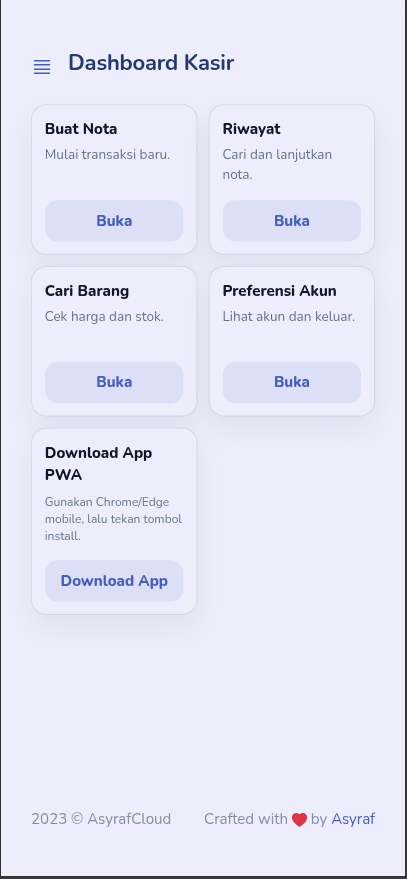</td>
    <td width="33%">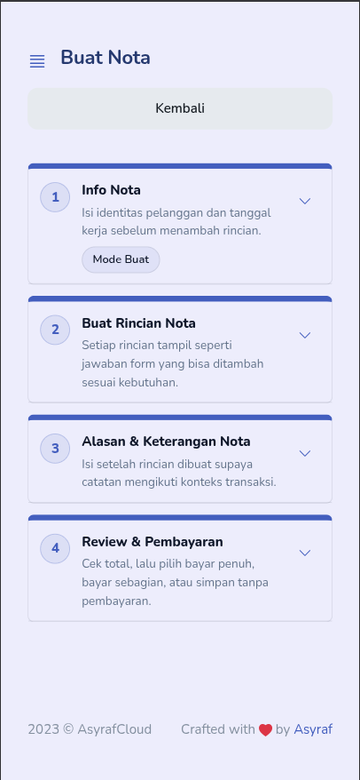</td>
    <td width="33%">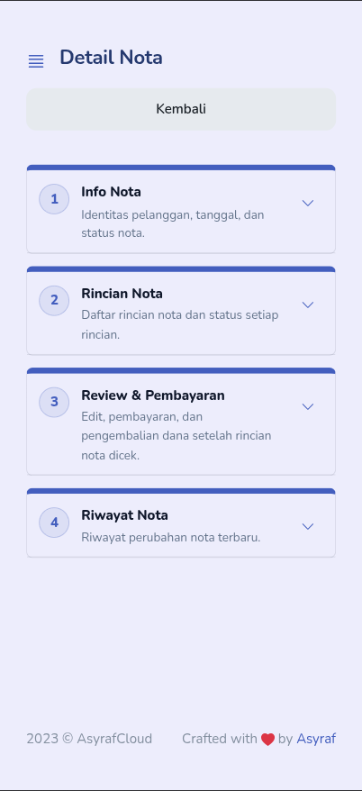</td>
  </tr>
  <tr>
    <td align="center"><sub>Cashier dashboard</sub></td>
    <td align="center"><sub>Create transaction</sub></td>
    <td align="center"><sub>Transaction detail</sub></td>
  </tr>
</table>

### Admin and reporting

<p align="center">
  
</p>

<p align="center"><sub>Admin overview: store summary, stock position, transaction cash book, obligations and operating costs.</sub></p>

<p align="center">
  
</p>

<p align="center"><sub>Operational analytics: payroll, expense composition, daily performance and best-selling items.</sub></p>

<table>
  <tr>
    <td width="50%">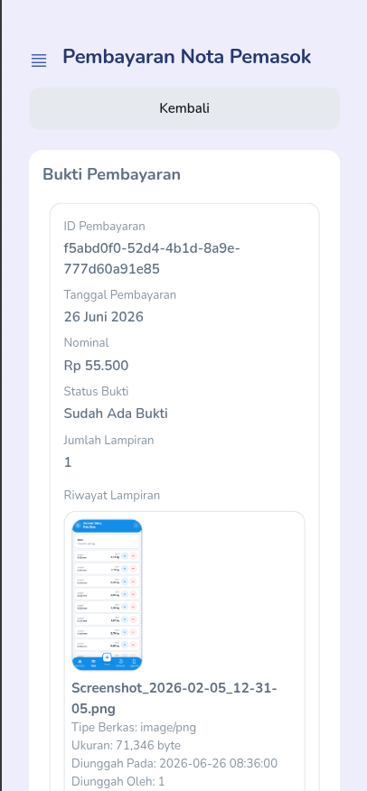</td>
    <td width="50%">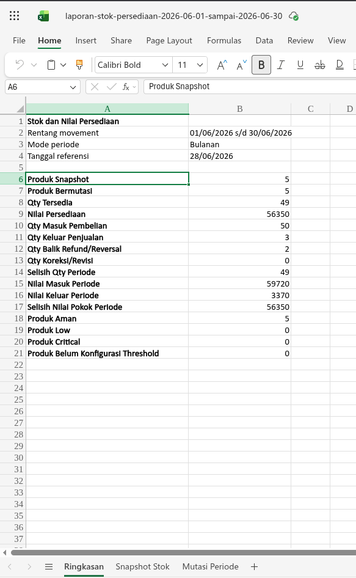</td>
  </tr>
  <tr>
    <td align="center"><sub>Supplier payment evidence</sub></td>
    <td align="center"><sub>Excel export</sub></td>
  </tr>
</table>

---

## Transaction Integrity

<p align="center">
  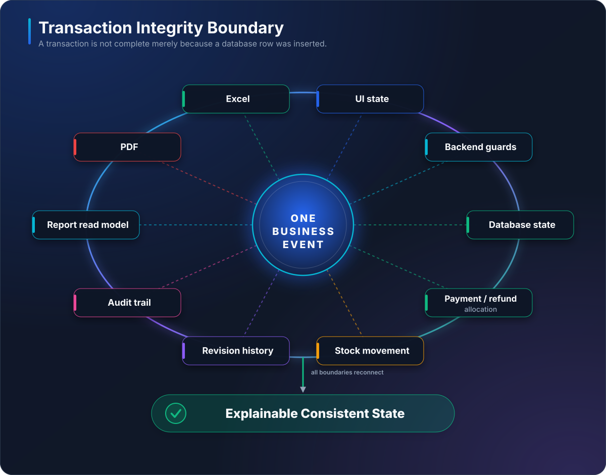
</p>

A business event is not considered safe merely because an INSERT succeeded. The system has to reconcile the same event through multiple boundaries:

- UI actions must match backend capabilities;
- backend guards must reject impossible allocation or stock states;
- payment/refund allocation must stay within executable capacity;
- stock movements must have an explainable source and reversal path;
- revisions must preserve history rather than silently overwrite meaning;
- reports and exports must reflect the same business interpretation as the current transaction state;
- sensitive mutations must remain auditable.

### Transaction lifecycle

<p align="center">
  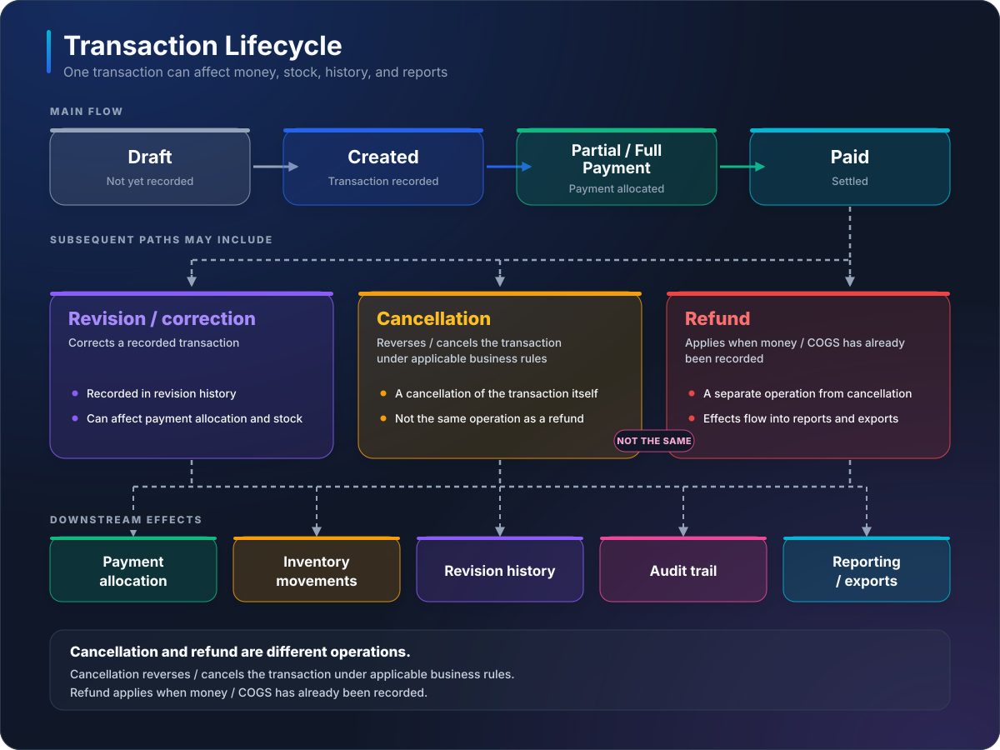
</p>

**Cancellation and refund are intentionally different concepts.** Cancellation reverses a transaction where business rules permit it. Refund handles value that has already entered the money/COGS lifecycle. Treating them as the same button is convenient right up until accounting, stock, and history disagree.

---

## Core Capabilities

### Transaction workspace

- product-only sales;
- service-only jobs;
- service + store-stock spare parts;
- service + external/case-cost parts;
- package/template-based service rows;
- inline cash or transfer payment;
- partial/full settlement;
- revision and correction workflows.

### Payment and refund lifecycle

- component-aware payment allocation;
- partial/full payment;
- over-allocation protection;
- retry/repeated-submit hardening;
- refundable-capacity checks;
- selected-row and full refund flows;
- post-refund reporting and inventory effects.

### Inventory and product lifecycle

- product catalog and versioning;
- stock adjustment and reversal;
- stock movement history;
- stock/cost projection rebuilds;
- negative-stock protection;
- soft delete and restore;
- refund/correction stock effects.

### Procurement and supplier finance

- supplier invoice lifecycle and revisions;
- supplier receipts and reversals;
- supplier payments and reversals;
- proof uploads;
- tax input and landed-cost allocation;
- rounding residue handling;
- received-invoice cost revaluation;
- supplier payable reporting.

### Reporting

- transaction summary;
- transaction cash ledger;
- operational profit;
- service-package profit;
- inventory movement and stock value;
- supplier payable;
- employee debt and payroll;
- operational expenses;
- PDF and Excel exports.

---

## Architecture

<p align="center">
  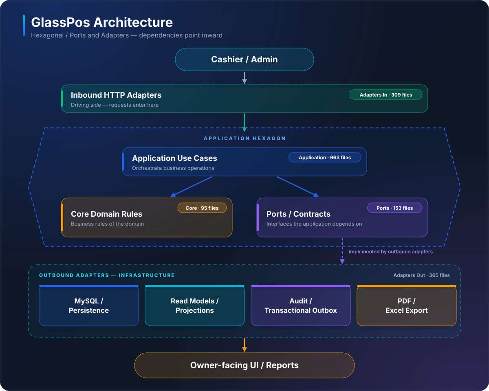
</p>

GlassPos follows a **Hexagonal / Ports and Adapters** direction so business behavior is not buried inside Blade templates, controllers, or arbitrary query fragments.

| Layer | Responsibility |
|---|---|
| `app/Core` | domain entities, invariants, value objects, validation rules |
| `app/Application` | use cases and transactional orchestration |
| `app/Ports` | contracts between business logic and infrastructure |
| `app/Adapters/In` | HTTP/request/presenter boundaries |
| `app/Adapters/Out` | persistence, projections, reporting queries, infrastructure |
| `resources/views` | presentation rendering |
| `tests` | unit, feature, characterization, regression, architecture tests |
| `docs` | ADRs, blueprints, audits, lifecycle evidence, runbooks, handoffs |

<details>
<summary><strong>Architecture composition</strong></summary>
<br>
<p align="center">
  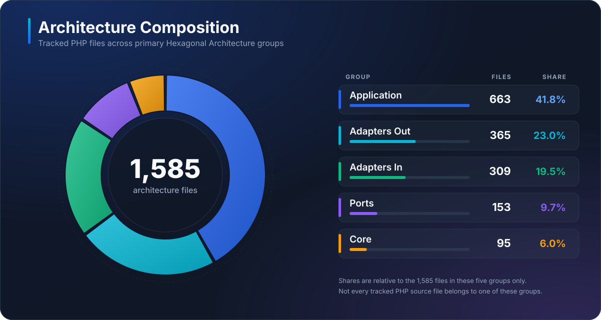
</p>
</details>

---

## Engineering Evidence

<p align="center">
  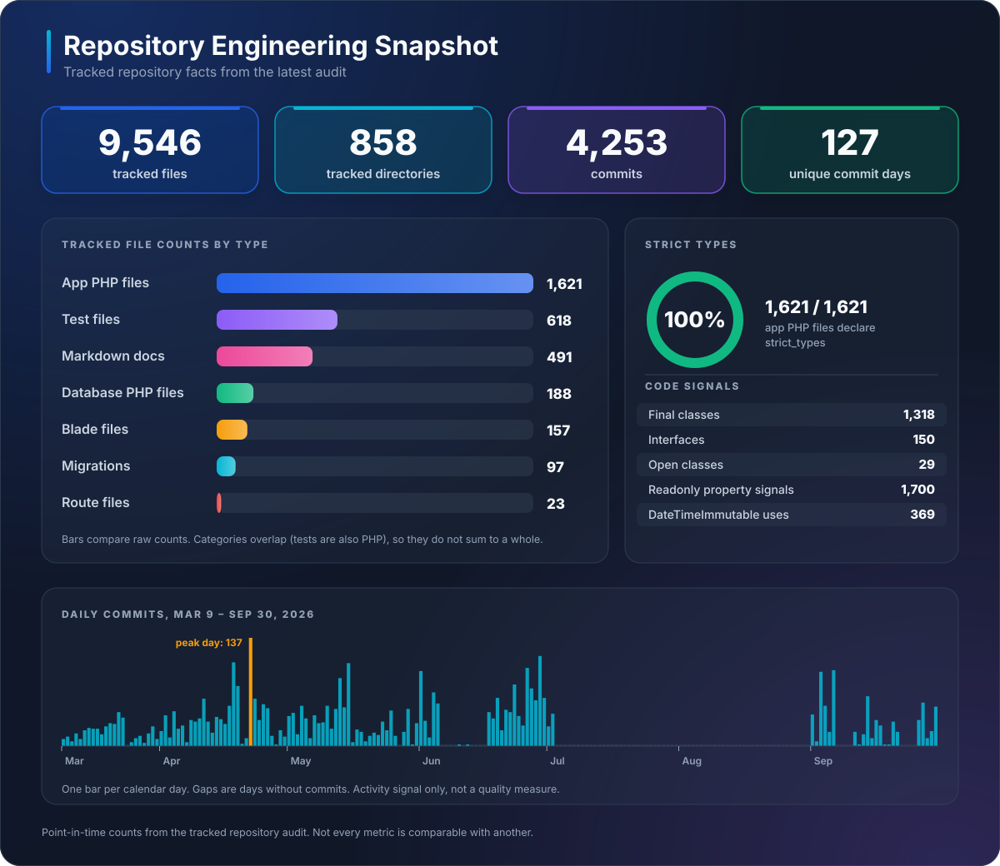
</p>

The repository intentionally keeps engineering proof close to the code. The current public evidence includes tracked-file-aware repository audits, architecture checks, manual QA converted into regression tests, ADRs, and lifecycle records.

> Metrics shown in these visuals are a **point-in-time audited development snapshot captured on 2026-09-30**, not eternal claims about the current HEAD. Use `make audit-git` to regenerate repository statistics.

### Verification commands

```bash
make help
make audit-git
make audit-lines
make audit-blade
make audit-contract
make verify
```

The latest full verification snapshot represented above records **1,849 passing tests, 14,308 assertions, zero PHPStan errors, passing line/Blade/contract audits, and 100% `strict_types` coverage across the audited application source snapshot**.

<details>
<summary><strong>Tracked LOC composition</strong></summary>
<br>
<p align="center">
  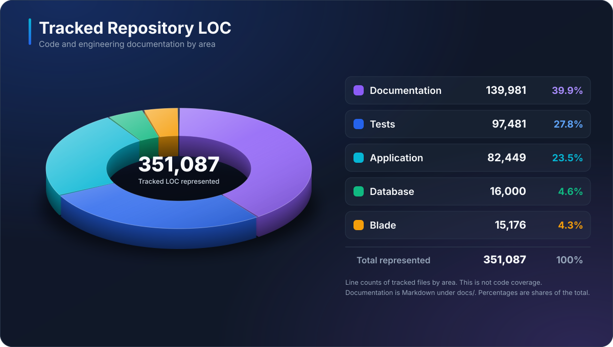
</p>
</details>

<details>
<summary><strong>Feature test density</strong></summary>
<br>
<p align="center">
  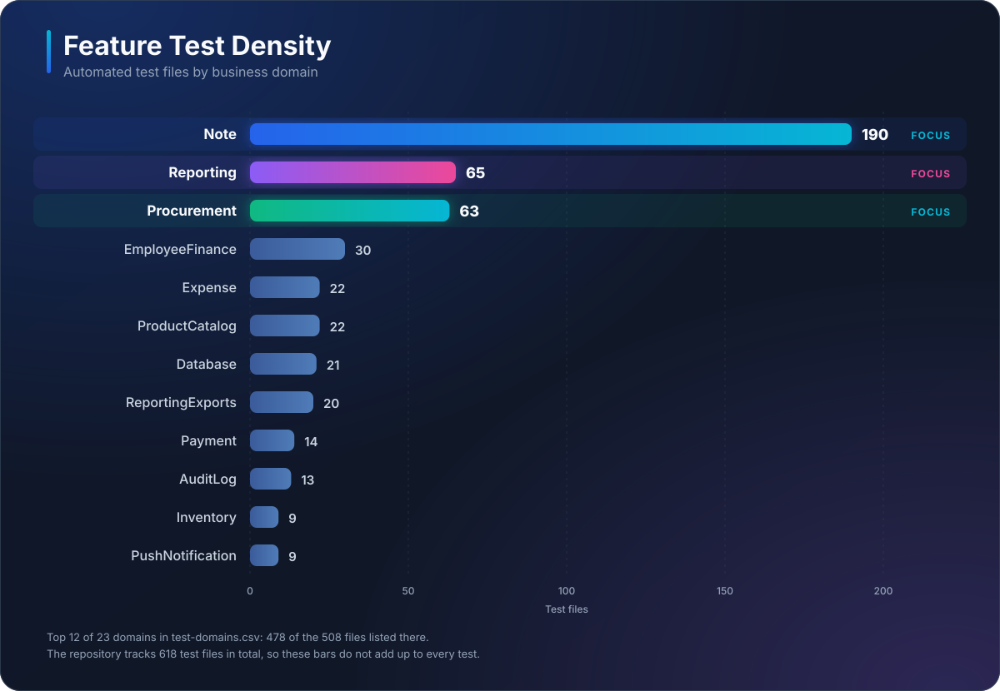
</p>
</details>

<details>
<summary><strong>Engineering activity by month</strong></summary>
<br>
<p align="center">
  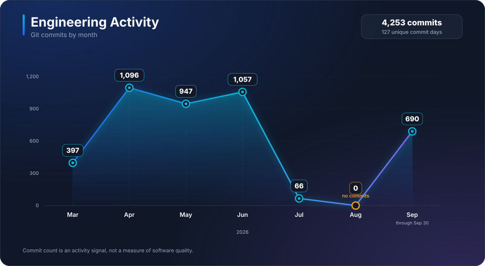
</p>
</details>

<details>
<summary><strong>Daily Git activity range</strong></summary>
<br>
<p align="center">
  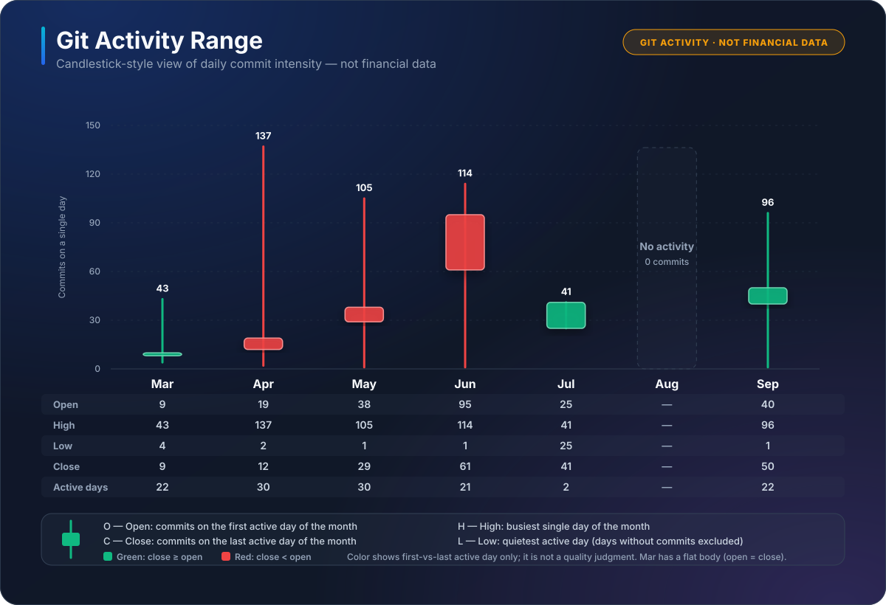
</p>
</details>

Commit volume is shown as development history, **not** as a quality metric. The useful evidence is whether invariants, failure modes, and production behavior are actually verified.

---

## Failure Modes Treated as First-Class Cases

The test suite and lifecycle documentation include protections around cases such as:

| Failure class | Examples |
|---|---|
| Duplicate execution | double-click create/payment/refund, refresh, repeated submit |
| Financial bounds | overpayment, over-refund, invalid component allocation |
| Transaction revision | edit after payment/refund, stale current revision, carry-forward settlement |
| Inventory | negative stock, duplicate movement, stale stock/cost projection |
| Reporting | current-state vs historical-cash ambiguity, PDF/Excel/screen disagreement |
| UI/backend drift | action shown in UI while backend cannot execute it |
| Production operations | read-only diagnosis before repair, timezone/source interpretation |

These are dull problems right until they touch money. Then every stakeholder suddenly develops an intense interest in edge cases.

---

## Production Context

GlassPos has been operated as a live Laravel/MySQL application for a real workshop environment.

Owner-reported operation metadata retained in this repository:

| Signal | Value |
|---|---:|
| Runtime | Laravel + MySQL |
| Deployment environment | shared / constrained hosting |
| MySQL update cycles while live | 12 |
| File update cycles while live | 31 |
| User-visible downtime during those cycles | 0 reported |
| Production data committed here | none |

Production database dumps, customer records, credentials, and operational secrets are deliberately excluded. Production repair policy is conservative: **diagnose read-only first; mutate only after the evidence is understood**.

---

## Documentation and Setup

| Document | Purpose |
|---|---|
| [`README_SETUP.md`](README_SETUP.md) | local installation, demo data, run and verification commands |
| [`README_TECHNICAL.md`](README_TECHNICAL.md) | engineering snapshot, architecture, domain boundaries, verification evidence |
| [`docs/0001_docs_help.md`](docs/0001_docs_help.md) | standards, ADRs, blueprints, lifecycle records and archives |

Quick entrypoint:

```bash
make help
make docs-help
```

---

## What This Repository Demonstrates

GlassPos is useful as a portfolio project because the interesting work is below the surface:

- modeling stateful transaction lifecycles instead of isolated CRUD screens;
- separating cancellation, correction, revision, payment, and refund semantics;
- protecting money and inventory through explicit invariants;
- designing read models and exports that remain reconcilable after mutations;
- maintaining traceable historical state;
- turning manual QA failures into automated regression coverage;
- evolving a large Laravel codebase under architectural and static-analysis guardrails;
- operating against real deployment constraints rather than a permanently fictional localhost.

<div align="center">

### CRUD is the alphabet. GlassPos is about what happens after the alphabet starts touching cash.

</div>
