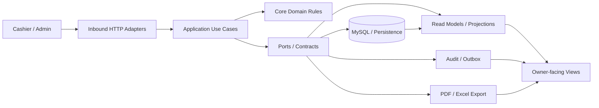
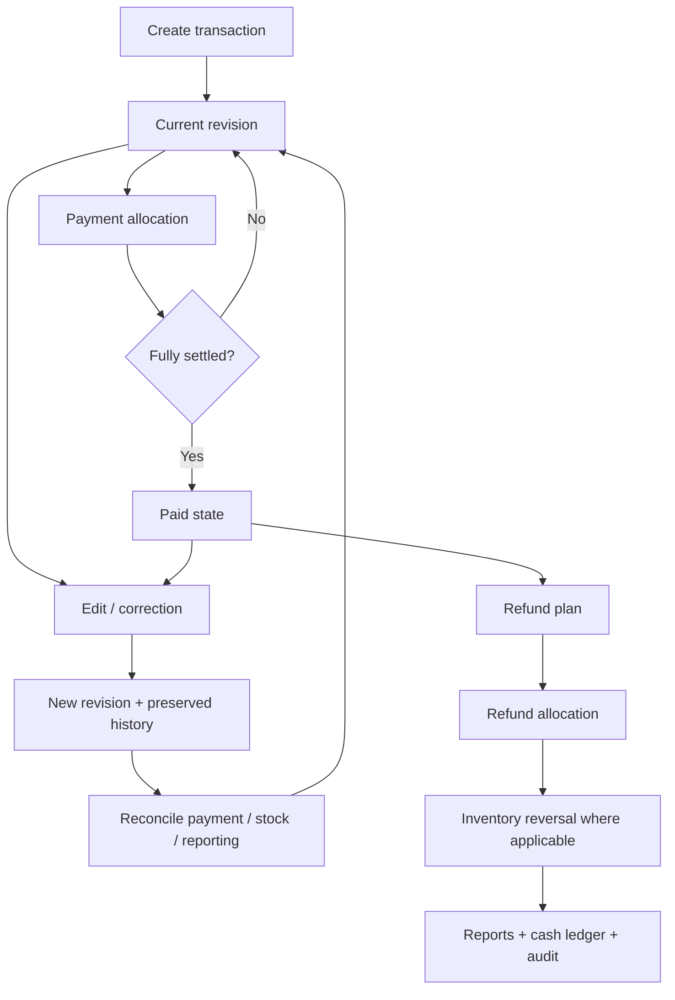
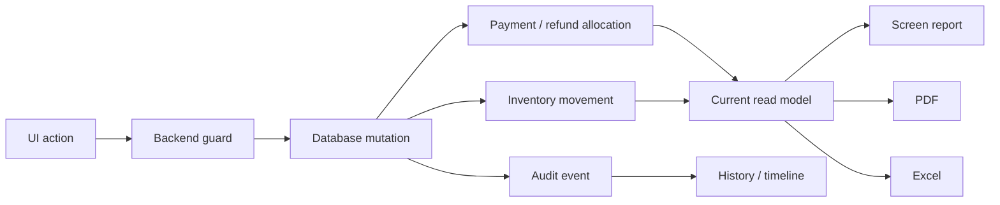

# GlassPos Technical README

> Engineering notes for a production-operated workshop POS where transaction correctness matters more than pretending every workflow is CRUD.

GlassPos is a Laravel/MySQL workshop POS and operations system built around mutable business state: cashier notes, service jobs, spare parts, supplier invoices, inventory movements, payments, refunds, revisions, audit trails, and operational reporting.

The main engineering problem is **state coherence**. A user action that changes money or stock must remain explainable across database state, read models, UI pages, revision history, PDF exports, Excel exports, and audit records.

For a product-level overview, screenshots, and portfolio entrypoint, start with [`README.md`](README.md). For local installation and demo data, use [`README_SETUP.md`](README_SETUP.md).

---

## Engineering Snapshot

Latest audited development snapshot: **2026-09-30**, source HEAD `3e03ee49`.

Repository statistics are generated from **Git-tracked files only** by `make audit-git`. Local dependencies, caches, generated artifacts, and unrelated untracked files are intentionally excluded.

| Signal | Verified snapshot |
|---|---:|
| Tracked files | **9,546** |
| Tracked directories | **858** |
| PHP source files in `app/` | **1,621** |
| PHP test files | **618** |
| Blade files | **157** |
| Markdown files in `docs/` | **491** |
| Database PHP files | **188** |
| Migrations | **97** |
| Route files | **23** |
| Git commits | **4,253** |
| Unique commit days | **127** |

### Tracked LOC

| Area | LOC |
|---|---:|
| `app/` PHP | **82,449** |
| `tests/` PHP | **97,481** |
| `database/` PHP | **16,000** |
| `resources/` Blade | **15,176** |
| `docs/` Markdown | **139,981** |

LOC is a density signal, not a quality score. Large codebases can still be elaborate ways to move bugs around. The useful evidence is the combination of boundaries, automated verification, explicit failure handling, and production behavior.

### Latest Full Verification Evidence

Latest local `make verify` result provided for this snapshot:

| Gate | Result |
|---|---:|
| PHPStan | **0 errors** |
| Line-count guardrail | **PASS** |
| Blade PHP/directive boundary audit | **PASS** |
| Contract audit | **PASS** |
| Pest tests | **1,849 passed** |
| Assertions | **14,308** |

These numbers describe a point-in-time verified development snapshot. They are deliberately not presented as code-coverage percentages.

---

## Architecture

GlassPos follows a **Hexagonal / Ports and Adapters** direction. Business rules are kept away from Blade templates and thin HTTP orchestration wherever practical.



| Layer | Responsibility |
|---|---|
| `app/Core` | Domain entities, invariants, value objects, validation rules |
| `app/Application` | Use cases, orchestration, transactional workflows |
| `app/Ports` | Contracts between application and infrastructure |
| `app/Adapters/In` | HTTP controllers, request boundaries, presenters |
| `app/Adapters/Out` | Persistence, projections, reporting queries, infrastructure implementations |
| `resources/views` | Presentation rendering |
| `database` | Migrations, factories, seeders, schema evolution |
| `tests` | Unit, feature, characterization, regression, architecture tests |
| `docs` | ADRs, blueprints, lifecycle evidence, audits, runbooks, handoffs |

### Structural Signals

| Group | Files |
|---|---:|
| Ports | **153** |
| Adapters/In | **309** |
| Adapters/Out | **365** |
| Core | **95** |
| Application | **663** |
| Test:source file ratio | **618:1621** |

### Strictness / Immutability Signals

| Signal | Value |
|---|---:|
| `strict_types` coverage | **1,621 / 1,621 (100%)** |
| Final class declarations | **1,318** |
| Open class declarations | **29** |
| Interface declarations | **150** |
| `readonly` property signals | **1,700** |
| `DateTimeImmutable` uses | **369** |

These are architectural signals, not claims that `final`, `readonly`, or more interfaces automatically produce good software. They show the style the repository consistently enforces.

---

## The Transaction Integrity Problem

A workshop sale is not simply `create order -> receive money -> print receipt`.

A single transaction can involve:

- product-only rows;
- service-only rows;
- service plus store-stock spare parts;
- service plus externally purchased / case-cost parts;
- package/template-driven rows;
- partial payment;
- cash and transfer payment;
- later correction or revision;
- selected-row or full refund behavior;
- stock reversal;
- report reconciliation;
- audit history.

The system therefore treats a transaction as a lifecycle rather than a mutable form row.



The critical property is not the diagram itself. It is that the UI action, backend guard, database mutation, stock movement, payment/refund allocation, current projection, report output, and audit trail should describe the **same event**.

---

## Engineering Rules

The project is built around several non-negotiable rules:

1. Business rules should not be buried in Blade, controllers, or arbitrary query fragments.
2. Money is represented as integer rupiah at the business boundary.
3. Stock movement must have a source and must be reversible or explainable.
4. Payment and refund allocation must not exceed backend-allocatable component capacity.
5. UI actions must not advertise operations that backend rules cannot execute.
6. Reports use explicit read models and reconciliation logic rather than treating UI tables as source of truth.
7. Sensitive mutations must remain auditable.
8. Revisions preserve history instead of silently overwriting business meaning.
9. Production diagnosis is read-only first. Blind data repair is not an acceptable first response.
10. Manual QA findings should become automated regression tests before closure.

---

## Main Business Domains

### Note / Transaction

The Note domain is the heaviest part of the system.

It covers:

- cashier transaction workspace;
- multi-line note creation;
- product-only, service-only, store-stock, and external-purchase rows;
- service package/template auto-fill;
- inline cash and transfer payments;
- partial and full payment;
- edit/revision after transaction creation;
- paid-note correction;
- revision settlement carry-forward;
- surplus/refund-due handling;
- selected-row and full refund lifecycle;
- current revision pointer;
- history projection;
- current detail read model;
- reporting consistency.

Representative risks include stale current revisions, duplicated submits, payment loss after revision, refund/payment re-entry, and reports reading obsolete note values.

### Payment

Payment is modeled as an **allocation problem**, not merely an inserted payment row.

The system handles:

- customer payments;
- cash detail;
- transfer payments;
- component-level allocation;
- selected-row payment;
- retry/repeated-submit behavior;
- over-allocation protection;
- legacy allocation compatibility;
- paid-note auto-close;
- cash-ledger/report visibility.

Representative failure classes include double-submit, paying already-settled components, paying non-payable/refunded components, and carrying partial settlement through revisions.

### Refund

Refund is modeled as a business event and allocation lifecycle rather than a negative-payment shortcut.

The system handles:

- refundable allocation discovery;
- selected-row refund plans;
- refund component allocation;
- pair/limit guards;
- full refund lifecycle;
- applicable inventory reversal;
- report and cash-ledger effects;
- edit/revision interactions after refund.

Representative risks include over-refund, refunding components that should not be refundable, stale refund UI, and refunded rows re-entering collectible state.

### Product / Inventory

Inventory is treated as operational ledger state rather than only a mutable `stock` number.

The system covers:

- product catalog;
- stock adjustments and reversal;
- stock projection rebuild;
- inventory costing projection rebuild;
- stock-out movement;
- refund/reversal stock return;
- negative-stock guardrails;
- product thresholds;
- product versioning;
- soft delete and restore.

Representative risks include movement without a source, stale projections, negative stock after revision, and deleting products still referenced by operational history.

### Procurement / Supplier Invoice

Procurement connects supplier documents to inventory and payable state.

It includes:

- supplier invoice creation and revision;
- version timelines;
- line mapping;
- tax input and summaries;
- landed-cost allocation;
- rounding residue handling;
- received-cost revaluation;
- inventory movement deltas;
- supplier payment and reversal;
- receipt and receipt reversal;
- payment proof upload;
- supplier payable reporting.

The important boundary is that changing a received supplier invoice is not treated as an isolated form edit. Cost, stock, version history, and payable state have to remain coherent.

### Reporting

Reporting is a read-model and reconciliation boundary, not merely a collection of tables.

Covered surfaces include:

- dashboard operational summaries;
- transaction summary;
- transaction cash ledger;
- operational profit;
- service-package profit breakdown;
- inventory movement and stock value;
- supplier payable;
- employee debt;
- payroll;
- operational expenses;
- PDF exports;
- Excel exports.

Hardening includes cash/transfer separation, refund visibility, owner-facing terminology, formula-injection protection for spreadsheet exports, PDF readability, and screen/PDF/Excel consistency tests.

### Employee Finance / Expense

Internal finance modules cover:

- employee master/versioning;
- employee debt;
- debt payment and reversal;
- debt principal adjustment;
- payroll disbursement and reversal;
- operational expenses;
- expense category lifecycle;
- employee-debt, payroll, and expense reporting.

### Audit / Security / Access

Hardening work includes:

- audit logs and snapshots;
- audit event writer;
- transactional audit outbox;
- role/capability boundaries;
- admin/cashier area separation;
- transaction-entry capability guards;
- public output/storage hardening;
- payment-proof content-type handling;
- XSS hardening;
- JavaScript URL hardening;
- login/rate-limit analysis;
- seeder credential boundaries.

---

## UI / Database / Report Coherence

The most important consistency chain is:



A bug can exist even when each individual layer appears locally correct. Examples include:

- a button appears actionable but backend allocation rejects it;
- a detail page uses the current revision while a report uses an obsolete revision;
- cash history is mathematically correct but misleading for current collectible state;
- screen totals and exported totals come from different interpretation rules;
- inventory reversal occurs without the report model observing the same business event.

Characterization and regression tests exist specifically to catch these cross-layer disagreements.

---

## Failure Classes Deliberately Tested

The repository contains or tracks regression coverage for failures such as:

| Class | Examples |
|---|---|
| Repeated actions | double-click create, payment, refund; browser refresh; repeated submit |
| Invalid monetary input | malformed values, zero amount, overpayment, over-refund |
| Revision drift | stale current revision, old value appearing in reports, lost settlement carry-forward |
| Inventory integrity | negative stock, duplicate lines, reversal mismatch, stale projections |
| UI/backend mismatch | visible action that backend cannot execute, stale modal payload |
| Reporting drift | current screen vs PDF vs Excel disagreement, stale read-model interpretation |
| Operational interruption | partial-completion assumptions, retry/idempotency behavior |
| Presentation leakage | internal state/labels escaping into owner-facing UI |

A green happy-path test is useful. A green test that reproduces a previously expensive failure is considerably more useful.

---

## Test Distribution Snapshot

Tracked feature-test files by domain from `make audit-git`:

| Domain | Test files |
|---|---:|
| Note | **190** |
| Reporting | **65** |
| Procurement | **63** |
| EmployeeFinance | **30** |
| ProductCatalog | **22** |
| Expense | **22** |
| Database | **21** |
| ReportingExports | **20** |
| Payment | **14** |
| AuditLog | **13** |
| PushNotification | **9** |
| Inventory | **9** |
| ServiceProductTemplate | **5** |
| Admin | **5** |
| Seeder | **3** |
| Infrastructure | **3** |
| IdentityAccess | **3** |
| Auth / Cashier / Foundation / ServiceCatalog / Support | **2 each** |
| Http | **1** |

This table counts test files, not test cases or coverage percentage.

---

## Repository Churn Signals

Historical churn can reveal where business complexity repeatedly concentrates.

Most frequently changed PHP/Blade paths in the audited snapshot include:

| Changes | Path |
|---:|---|
| 103 | `app/Providers/HexagonalServiceProvider.php` |
| 66 | `resources/views/admin/dashboard/index.blade.php` |
| 51 | `resources/views/cashier/notes/workspace/create.blade.php` |
| 47 | `routes/web/note.php` |
| 46 | `app/Application/Note/Services/NoteDetailPageDataBuilder.php` |
| 44 | `resources/views/layouts/partials/sidebar-admin.blade.php` |
| 43 | `resources/views/admin/procurement/supplier_invoices/create.blade.php` |
| 41 | `resources/views/admin/procurement/supplier_invoices/show.blade.php` |
| 38 | `resources/views/cashier/notes/show.blade.php` |
| 36 | `tests/Feature/Note/TransactionEditRefundPaymentStockReportingHardeningTest.php` |

Churn is not automatically bad. In this repository it is mainly useful as a pointer to integration-heavy surfaces that deserve stronger regression protection.

---

## Production Context

GlassPos has been operated as a live Laravel/MySQL application for a real workshop environment.

Owner-reported production-operation metadata retained in repository documentation:

| Signal | Value |
|---|---:|
| Runtime | Laravel + MySQL |
| Deployment environment | Shared / constrained hosting |
| MySQL update cycles while live | 12 |
| File update cycles while live | 31 |
| User-visible downtime during those update cycles | 0 reported |
| Production data committed to repository | None |
| Repair posture | Read-only diagnosis first |

Important boundary: this repository does **not** contain a production database dump, private customer data, credentials, or operational secrets. Production claims are limited to source code, repository documentation, owner-reported operation metadata, and local verification evidence.

---

## Timestamp Policy

Timestamp handling is intentionally separated from date-only business fields.

Owner-facing display timezone is controlled through `APP_DISPLAY_TIMEZONE`, with `Asia/Makassar` as the documented default.

Rules:

- timestamp display may be converted to the owner-facing timezone;
- date-only business fields must not be shifted as if they were timestamps;
- production timestamp repair requires evidence;
- production diagnosis is read-only first;
- ambiguous rows must not be bulk-shifted simply because a timezone mismatch is suspected.

This distinction exists because a timezone repair that changes the wrong field is not a repair. It is just data corruption wearing a helpful name.

---

## Documentation as an Engineering Control

The repository uses documentation as part of the change-management system rather than only as prose for readers.

| Path | Purpose |
|---|---|
| `docs/01_standards/` | Engineering and workflow standards |
| `docs/02_architecture/adr/` | Durable architecture/domain decisions |
| `docs/03_blueprints/` | Implementation plans, source maps, matrices |
| `docs/04_lifecycle/` | Active lifecycle work |
| `docs/05_audits/` | Audit evidence |
| `docs/99_archive/` | Closed lifecycle work and historical proof |

Stable entrypoints:

- [`docs/0001_docs_help.md`](docs/0001_docs_help.md)
- [`docs/README.md`](docs/README.md)

The public README stays readable; deep lifecycle evidence stays in the documentation tree.

---

## Verification

Repository-level verification:

```bash
make help
make audit-git
make audit-lines
make audit-blade
make audit-contract
make verify
```

Focused suites:

```bash
php artisan test tests/Feature/Note
php artisan test tests/Feature/Payment
php artisan test tests/Feature/Procurement
php artisan test tests/Feature/Reporting
php artisan test tests/Feature/ReportingExports
php artisan test tests/Unit
php artisan test tests/Arch
```

Documentation entrypoint:

```bash
make docs-help
```

`make audit-git` is intentionally tracked-file-aware so its repository metrics do not inflate when local dependencies, caches, generated files, or untracked workbench artifacts are present.

---

## Reader Boundary

Use [`README.md`](README.md) for:

- product positioning;
- visual overview;
- portfolio highlights;
- screenshots;
- high-level transaction lifecycle.

Use this file for:

- architecture;
- engineering constraints;
- repository density;
- verification evidence;
- domain failure classes;
- production-operation boundaries;
- audit/QA context.

Use [`README_SETUP.md`](README_SETUP.md) for installation and local review.

Do not place production secrets, credentials, database dumps, private customer data, or unredacted operational evidence in this repository.
